# 🛒 NextShop — Modern AI-Powered E-Commerce Platform

<p align="center">
  
  
  
  
  
</p>

---

## 🔗 Live Application
Experience the live application hosted on Vercel:  
👉 **[https://nextshop-coral-rho.vercel.app](https://nextshop-coral-rho.vercel.app)**

---

## 📸 User Experience & Previews

### 1. Landing Page & Catalog
Modern Obsidian Space storefront featuring a dark glassmorphic landing area with glowing ambient background orbs and a rich grid-based product catalog layout.
<p align="center">
  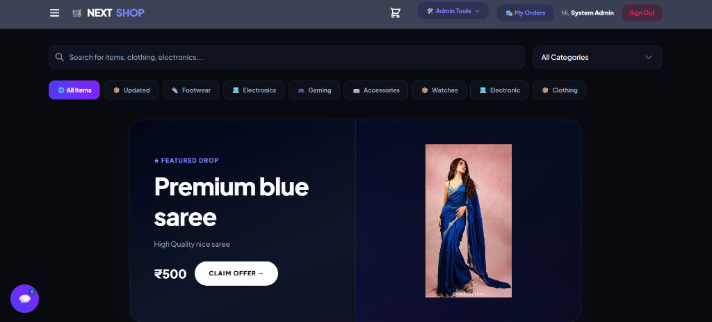
  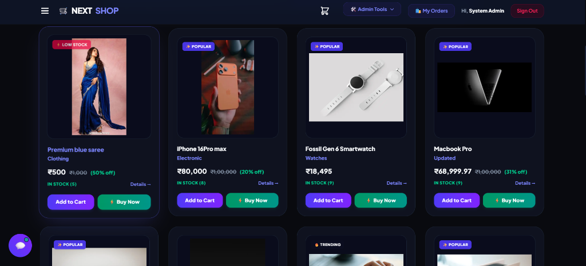
</p>

* **How it works:** Implements responsive flex/grid layouts styling using dark glassmorphism (`bg-slate-900/40 backdrop-blur-xl`) and glowing animations.
* **Advantages:** High visual appeal increases customer session length and highlights low-stock alerts and pricing claims in a clean, state-of-the-art interface.

---

### 2. Gemini AI Shopping Assistant
Interactive shopping assistant widget accessible store-wide to search items, review sentiment, and take operations.
<p align="center">
  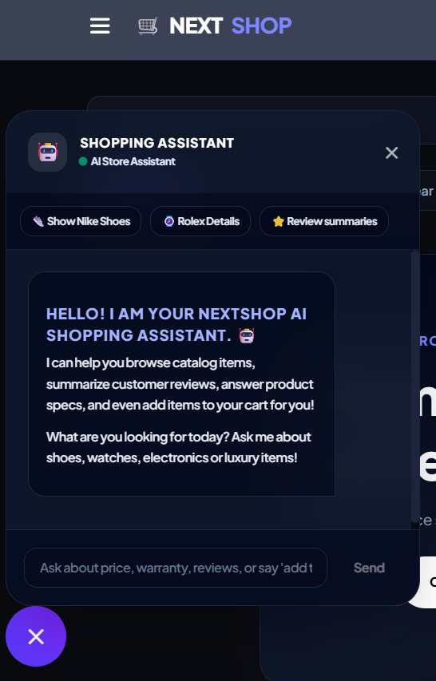
</p>

* **How it works:** Uses client-side state actions integrated with backend Gemini API models. Suggests quick queries and renders responses in fully formatted markdown bubbles.
* **Advantages:** Enables zero-click product search and adds products directly to the shopping cart via voice-like commands (e.g. *“add the iPhone to cart”*).

---

### 3. Slide-Over Shopping Cart
Interactive drawer to monitor selected products, modify item counts, and review subtotal estimations.
<p align="center">
  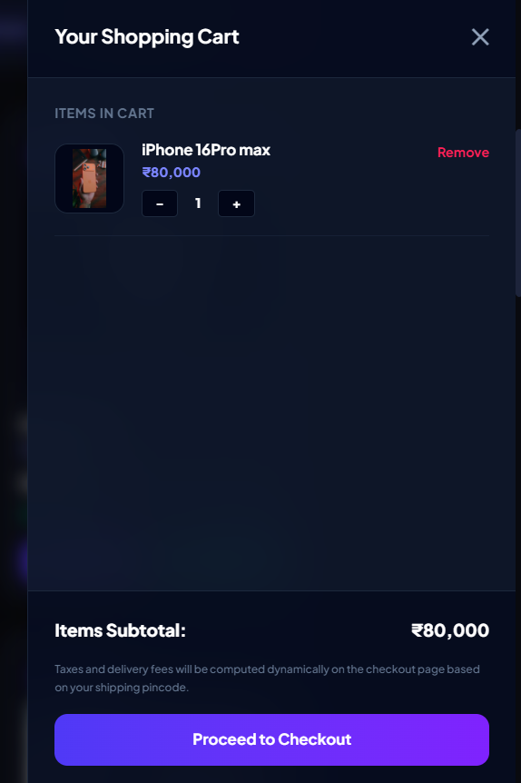
</p>

* **How it works:** Implements a global state-management system (`Zustand` Cart Store) to persist added products dynamically.
* **Advantages:** Offers smooth slide-in animations and live cost computations without requiring page reloads, ensuring a friction-free checkout entry.

---

### 4. Secure Checkout & Order History Tracking
Secure address parameters form with automatic location detection, combined with an order history tracker and progress indicator.
<p align="center">
  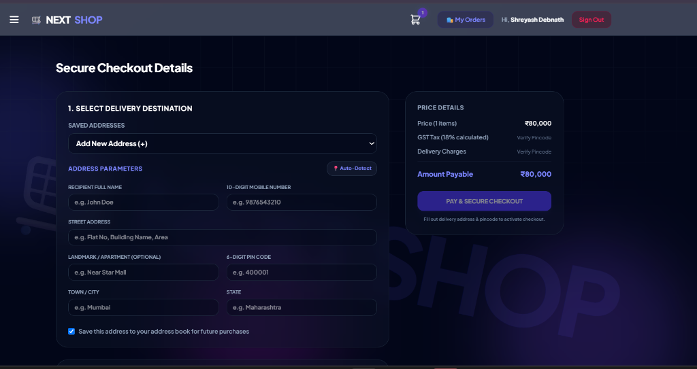
  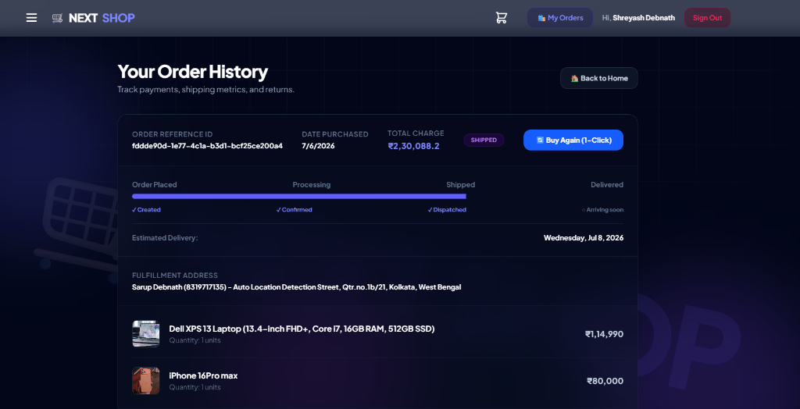
</p>

* **How it works:** Collects delivery variables, computes GST tax/shipping dynamically based on PIN codes, and integrates a timeline tracker to check package status.
* **Advantages:** Increases successful deliveries with autodetected addresses and builds customer trust by providing transparency over fulfillment progress with a 1-click reorder button.

---

### 5. Real Payment Simulation (Razorpay Test Mode)
Secure payment gateway integration simulating card transactions, netbanking options, or pay-later checkouts.
<p align="center">
  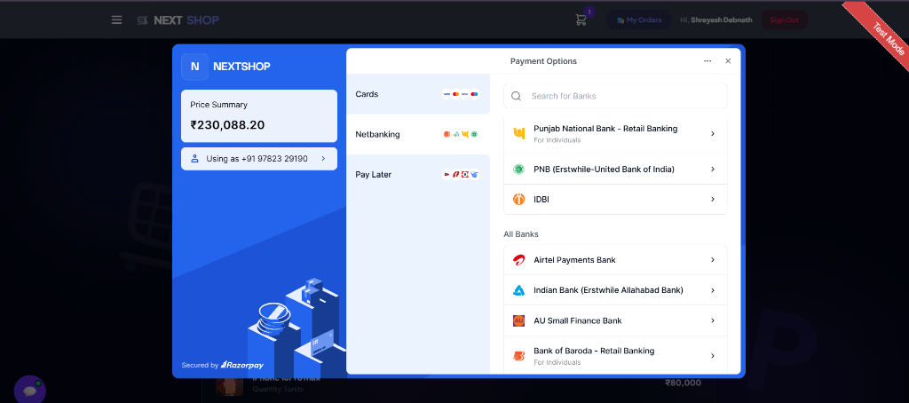
  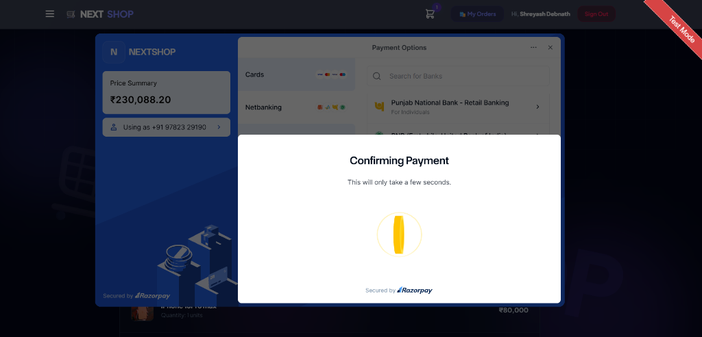
</p>

* **How it works:** Integrates Razorpay SDK on the frontend for secure checkouts, communicating via API endpoints and webhooks to verify transactions in test mode.
* **Advantages:** Simplifies integration testing by simulating successful/failed payments, and ensures smooth client checkout flows before going live.

---

### 6. Order Cancellations & Return Requests
Streamlined request modals for customers to easily request cancellations or log item returns.
<p align="center">
  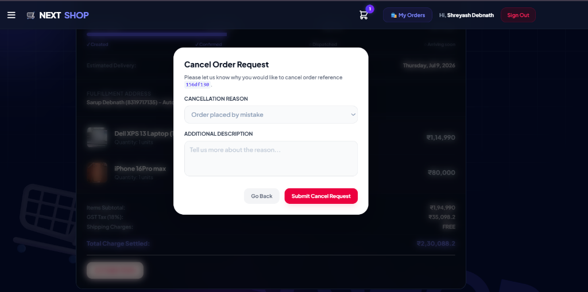
</p>

* **How it works:** Displays dedicated popup modals on the order history page. Collects cancellation/return reasons and logs them instantly for admin review.
* **Advantages:** Improves user experience by giving customers control over their orders, reducing support ticket loads and automating the returns lifecycle.

---

## 📊 Admin Portals & Dashboards

### 1. Business Analytics & Order Operations Dashboard
Complete store status monitoring showing rolling revenues, conversion velocities, low-stock counts, and interactive tracking.
<p align="center">
  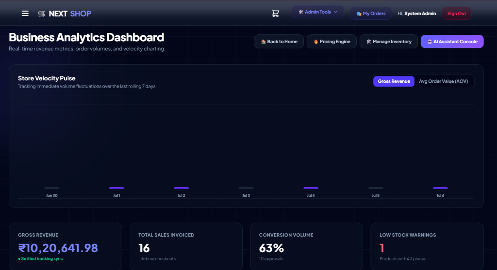
</p>

Full order ledger with delivery address details, invoice itemization, and an inline status selector (Pending, Processing, Shipped, Delivered, Cancelled, Returned) to manage full lifecycle operations.
<p align="center">
  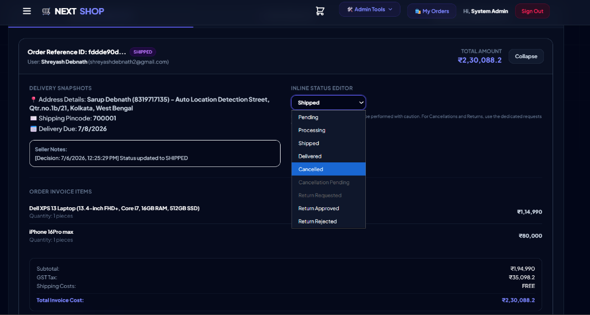
</p>

* **How it works:** Aggregates real-time database checkouts, order logs, and stock statistics, displaying them in glassmorphic layouts.
* **Advantages:** Gives administrators instant visibility over cash flow, automatic warnings on low-stock items, and a central portal to fulfill or cancel client orders.

---

### 2. Autonomous Demand Pricing Engine
Dynamic price optimizer that evaluates sales velocity and automatically recommends strategy adjustments to maximize margins.
<p align="center">
  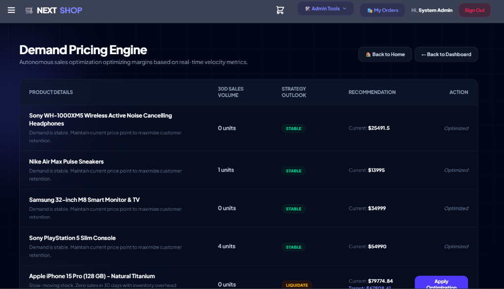
</p>

* **How it works:** Analyzes 30-day sales volume per product to compute sales speed. If stock is slow, it suggests a `LIQUIDATE` discount strategy; if demand is steady, it preserves a `STABLE` premium price point.
* **Advantages:** Maximizes profits on high-demand inventory while accelerating warehouse clearance for slow-moving products with one-click optimization triggers.

---

### 🤖 AI Agent Command Center & Creation tools

#### Inventory Control & Product Creator
Table layout to directly edit details or delete listings, paired with a registration sheet for adding fresh assets.
<p align="center">
  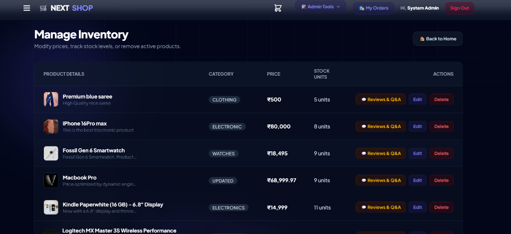
  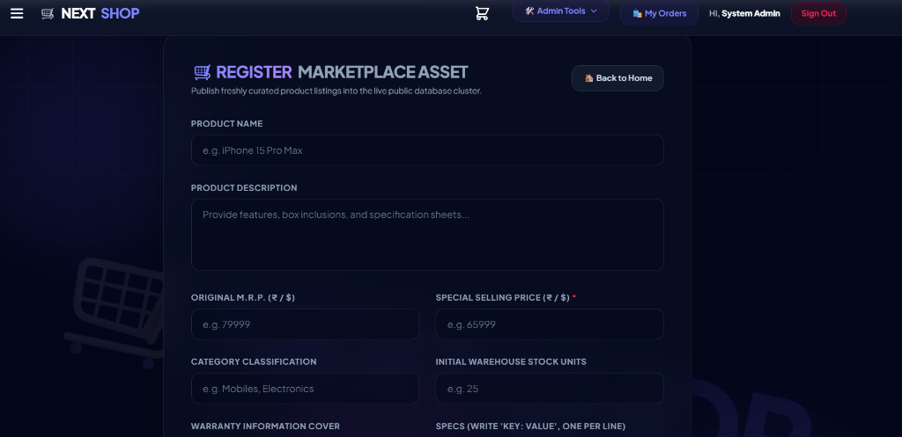
</p>

#### AI Agent Command Console
Terminal command interface powered by `gemini-2.0-flash`. Directly connected to database clusters with write permission.
<p align="center">
  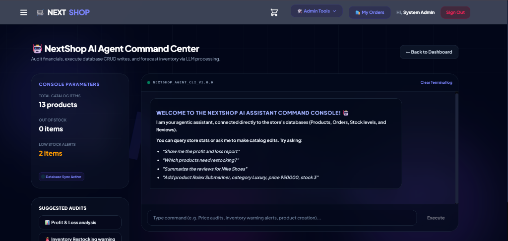
</p>

---

## ✨ Overview
**NextShop** is a premium, high-performance e-commerce platform built on Next.js 15. It features a unique, futuristic **Obsidian Space Glassmorphism** design theme, detailed admin business metrics, evolution charting, and is powered directly by advanced Google Gemini AI Agents to help both customers browse and admins manage products in real-time.

---

## 🎨 Key Features & Visual Refinements

### 🌌 Obsidian Space Glassmorphic Design
- Customized layout with smooth, luminous radial glow orbs (`bg-indigo-500/20`, `bg-violet-500/20`, and `bg-fuchsia-500/15`).
- Beautiful glass panels backed by `backdrop-blur-xl` and premium borders to make elements feel responsive and premium.
- Huge, semi-transparent background watermark logos (`NEXTSHOP` rotated at 12° with `9%` opacity) visible behind the product elements.

### 🤖 Gemini-Powered Customer AI Assistant
- Interactive floating customer chat assistant (**Shopping Assistant** 💬).
- Completely styled with dark theme panels and highly visible bubbles (your chats are dark indigo with white text; AI chats are clear light slate text).
- Capable of answering specs, calculating prices, summarising feedback sentiment, and directly adding products to your shopping cart (`addToCart` integration).

### 🖥️ NextShop AI Agent Command Center (Admin)
- Dedicated terminal dashboard powered by **`gemini-2.0-flash`** for instant response velocity (~3-4s processing).
- Interactive stats parameters (Total products, Out of stock, Low stock warnings) updated dynamically from the database.
- Full write authorization: admins can type or click quick suggestions (e.g. *“Add product Rolex Submariner, price 950000...”*) to execute database writes/updates directly via AI actions.

### 📈 Business Analytics & Operations Dashboard
- Real-time revenue metrics, order volumes, and financial transaction summaries.
- Role-based permissions guarding: Sidebar triggers and links are hidden for non-authenticated guests and partition functions strictly between customer profiles and administrator controls.

---

## 🛠️ Technology Stack
- **Core Framework**: Next.js 15 (App Router with Server/Client components)
- **Styling & Theme**: Tailwind CSS (Obsidian Space glassmorphic palette)
- **Database Engine**: Prisma ORM with SQLite/Postgres compatibility
- **Artificial Intelligence**: Google Gemini API (`gemini-2.0-flash`)
- **Payment Processing**: Razorpay Webhooks Integration
- **Deployments**: Vercel Serverless Hosting

---

## ⚙️ Local Development Setup

Follow these steps to run the application locally on your machine:

### 1. Clone the Repository
```bash
git clone https://github.com/Shreyash-coder40/E-commerce-Website.git
cd E-commerce-Website
```

### 2. Install Dependencies
```bash
npm install
```

### 3. Setup Environment Variables
Create a `.env` file in the root directory and add the following keys:
```env
DATABASE_URL="file:./dev.db" # Or your remote SQL/Postgres URI
NEXTAUTH_SECRET="your_nextauth_secret_token"
NEXTAUTH_URL="http://localhost:3000"

# AI Integrations
GEMINI_API_KEY="your_google_gemini_api_key"

# Payments Configuration
RAZORPAY_KEY_ID="your_razorpay_key_id"
RAZORPAY_KEY_SECRET="your_razorpay_key_secret"
```

### 4. Database Setup & Migrations
```bash
npx prisma generate
npx prisma db push
```

### 5. Spin up the Local Development Server
```bash
npm run dev
```
Open **[http://localhost:3000](http://localhost:3000)** in your browser to view the application.

---

## 🔒 Security & Privacy
No private credentials, API keys, or `.env` files are stored in this public repository. All secrets are configured locally or safely injected via the Vercel deployment console environment variables, keeping database and service integrations secure.
